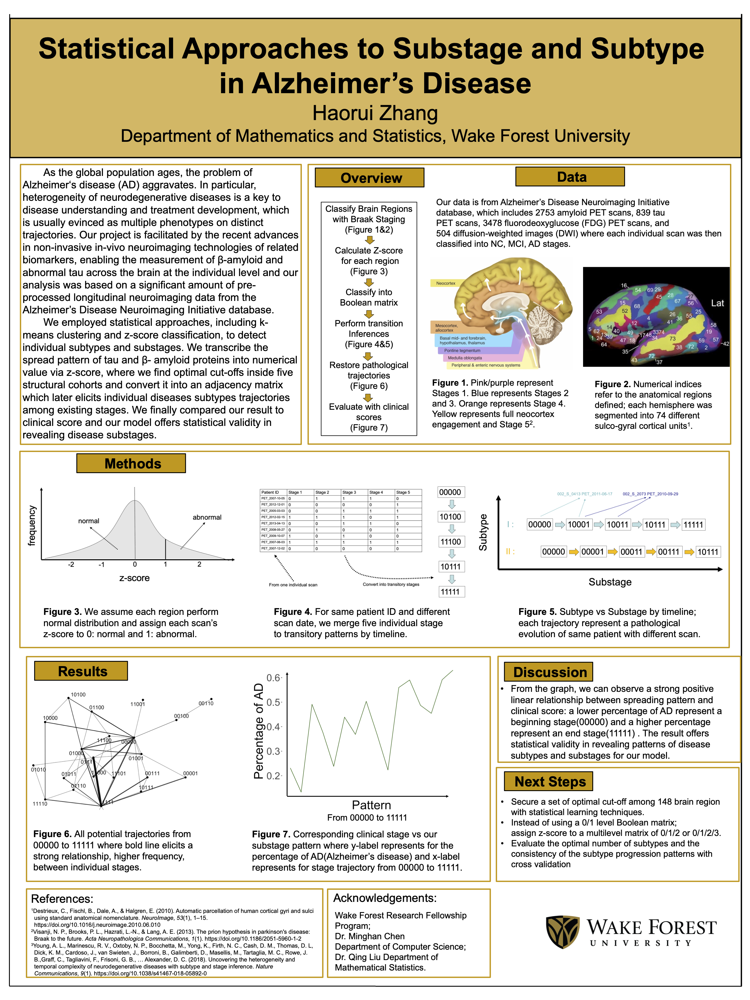
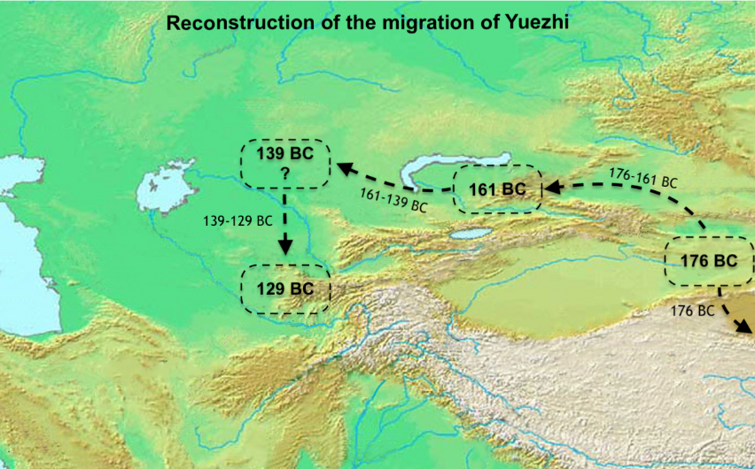
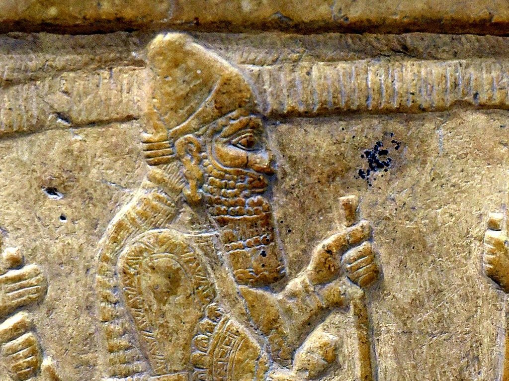

# Portfolio
---
## Computational Biology Data Science

### Uncovering the dynamic effects of DEX treatment on lung cancer by integrating bioinformatic inference and multiscale modeling of scRNA-seq and proteomics data

Our team developed a novel Bioinformatic Inference and Multiscale Modeling (BIMM) method, employing a multiscale model of tumor regulation in providing insights of computational studeies in tumorigenesis and oncotherapy. Our article had been recently accepted by [***Computers in Biology and Medicine***](https://www.sciencedirect.com/science/article/abs/pii/S0010482522007235)

**Mathematical Modeling:**  Raw A549 cell data was translated into a system of ordinary differential equations (ODEs) based on biochemical rationales to
describe reactions of synthesis, degradation, phosphorylation, and dephosphorylation.

**Survival Analysis:** Kaplan-Meier (KM) analysis was performed using the “survival” R package (http://cran.rproject.org/web/packages/survival/index.html) Log-rank test was used to test the differences in survival curves.

**Parameter optimization:** We optimized the model parameters of the ODE system by minimizing the residual error between empirical data and simulated results. Different optimization algorithms are used and compared to find the optimal parameter set.
 

 

---
### Uncovering system vulnerability and criticality of human brain under evolving neuropathological events in Alzheimer's Disease

In this work, we characterized the interaction of AT[N] biomarkers and their propagation across brain networks using a novel bistable reaction-diffusion model. We applied our model to large-scale longitudinal neuroimages from the ADNI database and studied the systematic vulnerability and criticality of brains. Our paper was recently under review by [***Neuroimage***](https://arxiv.org/abs/2201.08941).

**Major Findings:** 
Our major findings include (i) tau is a stronger indicator of regional risk compared to amyloid, (ii) temporal lobe exhibits higher vulnerability to AD-related pathologies, (iii) proposed critical brain regions outperform hub nodes in transmitting disease factors across the brain, and (iv) disruption of metabolic balance is the most determinant factor contributing to the initiation and progression of Alzheimer's disease. 
 

 

**Reaction-diffusion model:**
Our proposed network-guided biochemical model consists of a classic bistable model and network diffusion. This relatively simple model enabled us to investigate the spatiotemporal dynamics of ATN biomarkers in AD by capturing the essence of the underlying mechanism of complex biological phenomena. The pathological network is an integration of ATN reactions and network diffusion. At each brain region, the production (①, ③) and clearance (②, ④) of amyloid and tau proteins are included in the model following zero-order and first-order mass-action kinetics, respectively. 
 

 

---
### Statistical Appoarches to Subtype and Subtage Detection in Alzheimers' Disease 

We employed statistical approaches, including kmeansclustering and z-score classification, to detect individual subtypes and substages. We transcribe the spread pattern of tau and β- amyloid proteins into numerical value via z-score, where we find optimal cut-offs inside five structural cohorts and convert it into an adjacency matrix which later elicits individual diseases subtypes trajectories among existing stages. We finally compared our result to clinical score and our model offers statistical validity in revealing disease substages.

 

 

---
## History and Archeology

Besides Data Science, I also have a great passion for history and archeology. I enjoyed using data science methodologies into field of history to solve unsettled problem.
 

### Interaction and Distances in the Amarna Letters

In this project, I employed Python NLP packages to identify a positive relationship between different political entities and characters. I implemented NLTK in cleaning, tokening, and merging over 300 letters, 100 names, and 40 interactions where I subsequently test the hypothesis that greetings can be classified into different level of obsequiousness based on geographical location. 

 

 

---
### Reconstruction of the histroical migration of Yuezhi people

My paper concerns a nomadic tribe in Central Asia, the Yuezhi, in the mid-second century BC. At this time the Yuezhi were unable to defeat two other nomadic confederations. As a result, the Yuezhi were forced to migrate westward from their original homeland in the Chinese province of Gansu to the Ili valley in modern Kazakistan. Eventually, they migrated all the way to ancient Bactria, the northern part of modern Afghanistan. My purpose is to resolve the date of the Yuezhi’s migration from the Ili valley to Bactria. According to Craig Benjamin, the Yuezhi were expelled from their settlement in the Ili valley by another nomadic confederation, the Wusun, by 131 BC. However, a closer reading of the historical records reveals that there is no evidence to support Benjamin’s dating scheme. My paper was accepted by the [***silk road conference student panel***](https://events.wfu.edu/event/the_silk_roads_from_local_realities_to_global_narratives#.Yyql93bMJPY)

 

 

---
### Lion in Hittite culture --Mursili’s conquest of Babylonia and the return of Marduk

Lion is a widespread symbol in the ancient Near East. The royal association of the lion is well attested in numerous metaphors applied to kings in both Sumerian and Akkadian texts as well as their artistic evidence. Away from Mesopotamia, the Hittites also show their traces from the Babylonians as well. In their tradition, lion was not only one of the most important animal metaphors, but was also an approach employed by the kings. This essay aimed to find a way of acting in the early Hittite kings—the Line of the Lions, Hattusili I, Mursili I and Usurpers, Hantili I, Zidanta I, Ammuna I. The conquest of Babylonia appears to be taking much more historical significance in Hittite history. Not only it marked an end of the early Hittite supremacy, but also silently diminished the idea of lions speaking on the behalf of Telipinu.

 

 

---

© 2022 Haorui Zhang. Powered by Jekyll and the Minimal Theme.

