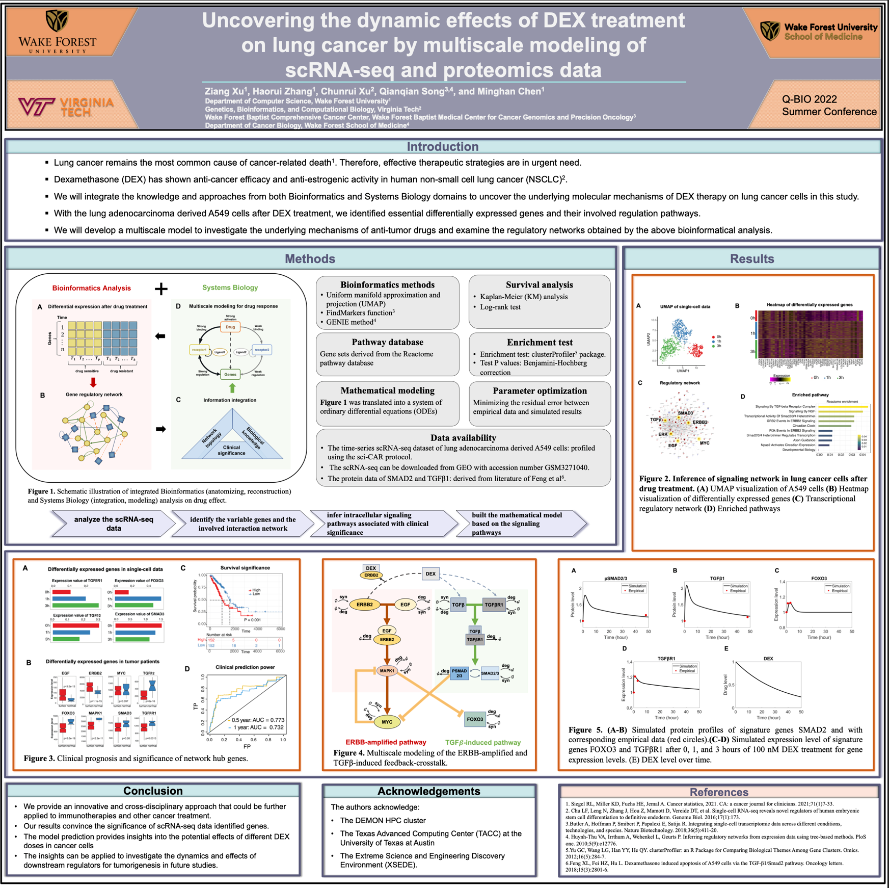
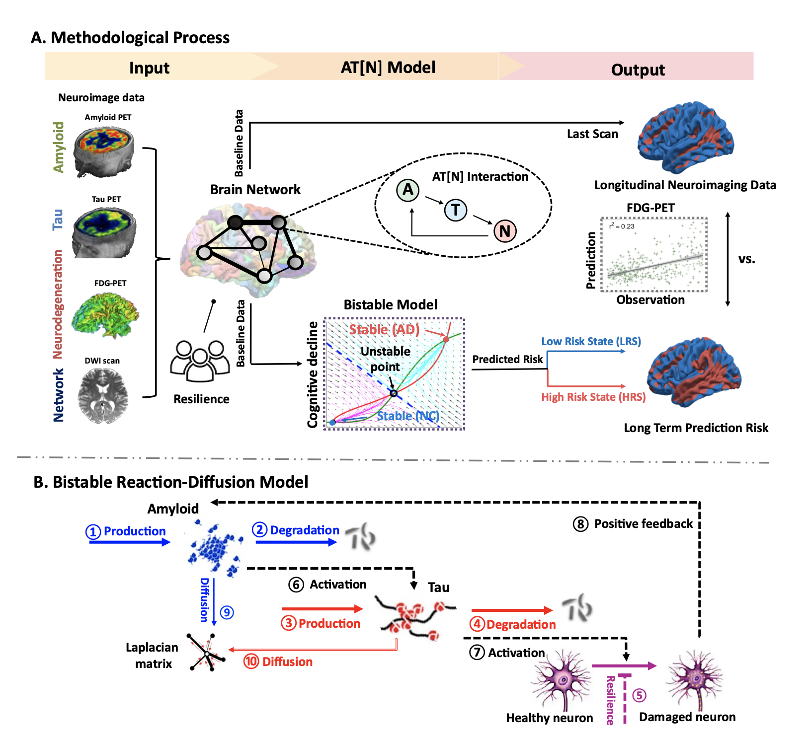
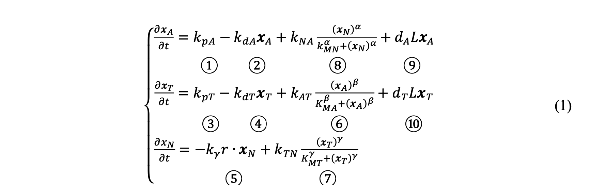

# Portfolio
---
## Computational Biology

### Uncovering the dynamic effects of DEX treatment on lung cancer by integrating bioinformatic inference and multiscale modeling of scRNA-seq and proteomics data

Our team developed a novel Bioinformatic Inference and Multiscale Modeling (BIMM) method, employing a multiscale model of tumor regulation in providing insights of computational studeies in tumorigenesis and oncotherapy. Our article had been recently accepted by [***Computers in Biology and Medicine***](https://www.sciencedirect.com/science/article/abs/pii/S0010482522007235)

[]

**Mathematical Modeling:**  Raw A549 cell data was translated into a system of ordinary differential equations (ODEs) based on biochemical rationales to
describe reactions of synthesis, degradation, phosphorylation, and dephosphorylation.

**Survival Analysis:** Kaplan-Meier (KM) analysis was performed using the “survival” R package (http://cran.rproject.org/web/packages/survival/index.html) Log-rank test was used to test the differences in survival curves.

**Parameter optimization:** We optimized the model parameters of the ODE system by minimizing the residual error between empirical data and simulated results. Different optimization algorithms are used and compared to find the optimal parameter set.

---
### Uncovering system vulnerability and criticality of human brain under evolving neuropathological events in Alzheimer's Disease

In this work, we characterized the interaction of AT[N] biomarkers and their propagation across brain networks using a novel bistable reaction-diffusion model. We applied our model to large-scale longitudinal neuroimages from the ADNI database and studied the systematic vulnerability and criticality of brains. Our paper was recently under review by [***Neuroimage***](https://arxiv.org/abs/2201.08941).

**Major Findings:** 
Our major findings include (i) tau is a stronger indicator of regional risk compared to amyloid, (ii) temporal lobe exhibits higher vulnerability to AD-related pathologies, (iii) proposed critical brain regions outperform hub nodes in transmitting disease factors across the brain, and (iv) disruption of metabolic balance is the most determinant factor contributing to the initiation and progression of Alzheimer's disease. 

**Reaction-diffusion model:**
Our proposed network-guided biochemical model consists of a classic bistable model and network diffusion. This relatively simple model enabled us to investigate the spatiotemporal dynamics of ATN biomarkers in AD by capturing the essence of the underlying mechanism of complex biological phenomena. The pathological network is an integration of ATN reactions and network diffusion. At each brain region, the production (①, ③) and clearance (②, ④) of amyloid and tau proteins are included in the model following zero-order and first-order mass-action kinetics, respectively. 

---
### Statistical Appoarches to Subtype and Subtage Detection in Alzheimers' Disease 

---
### Detect Spam Messages: TF-IDF and Naive Bayes Classifier

In order to predict whether a message is spam, first I vectorized text messages into a format that machine learning algorithms can understand using Bag-of-Word and TF-IDF. Then I trained a machine learning model to learn to discriminate between normal and spam messages. Finally, with the trained model, I classified unlabel messages into normal or spam.

 

 

---
## Data Science

### Credit Risk Prediction Web App

After my team preprocessed a dataset of 10K credit applications and built machine learning models to predict credit default risk, I built an interactive user interface with Streamlit and hosted the web app on Heroku server.

 

 

---
### Kaggle Competition: Predict Ames House Price using Lasso, Ridge, XGBoost and LightGBM

I performed comprehensive EDA to understand important variables, handled missing values, outliers, performed feature engineering, and ensembled machine learning models to predict house prices. My best model had Mean Absolute Error (MAE) of 12293.919, ranking <b>95/15502</b>, approximately <b>top 0.6%</b> in the Kaggle leaderboard.

 

 

---
### Predict Breast Cancer with RF, PCA and SVM using Python

In this project I am going to perform comprehensive EDA on the breast cancer dataset, then transform the data using Principal Components Analysis (PCA) and use Support Vector Machine (SVM) model to predict whether a patient has breast cancer.

 

 

---
### Business Analytics Conference 2018: How is NYC's Government Using Money?

In three-month research and a two-day hackathon, I led a team of four students to discover insights from 6 million records of NYC and Boston government spending data sets and won runner-up prize for the best research poster out of 18 participating colleges.

 

 

---
## Filmed by me

Besides Data Science, I also have a great passion for photography and videography. Below is a list of films I documented to retain beautiful memories of places I traveled to and amazing people I met on the way.

 

- [Ada Von Weiss - You Regret (Winter at Niagara)](https://www.youtube.com/watch?v=-5esqvmPnHI)
- [The Weight We Carry is Love - TORONTO](https://www.youtube.com/watch?v=vfZwdEWgUPE)
- [In America - Boston 2017](https://www.youtube.com/watch?v=YdXufiebgyc)
- [In America - We Call This Place Our Home (Massachusetts)](https://www.youtube.com/watch?v=jzfcM_iO0FU)

---

© 2020 Khanh Tran. Powered by Jekyll and the Minimal Theme.

